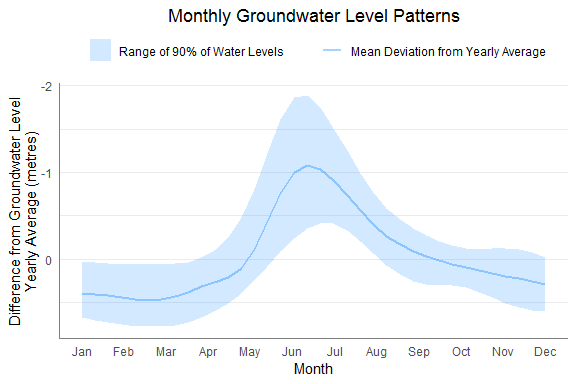
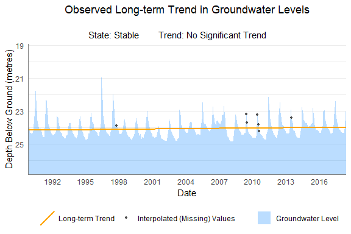

You can install the 'bcgroundwater' R <U+0001F4E6> package directly from [GitHub](https://github.com/bcgov/bcgroundwater). To do so, you will 
need the [remotes](https://cran.r-project.org/web/packages/remotes/index.html) package:


```r
install.packages("remotes")
```

Next, install the `bcgroundwater` package using `remotes::install_github()`:


```r
library("remotes")
install_github("bcgov/bcgroundwater")
```

Then load the package:


```r
library(bcgroundwater)
```


## Get Your Data

First, decide which groundwater observation well is your well of interest from the British Columbia Provinicial Groundwater Observation Well Monitoring
Network [interactive map tool](https://www2.gov.bc.ca/gov/content?id=2D3DB9BA78DE4377AB4AE2DCEE1B409B). Here we will work with data from Groundwater Observation Well **#309**.
  
  
Download data on the well of interest&mdash;this may take a few moments.
  
  
If you are interested in daily averages, specify `which = "daily"`:


```r
daily_data <- get_gwl(wells = 309, which = "daily")
head(daily_data)
```

```
##   Well_Num EMS_ID Station_Name       Date    GWL Historical_Daily_Average
## 1      309     NA           NA 1989-10-19 23.971                 24.05019
## 2      309     NA           NA 1989-10-31 23.994                 24.08726
## 3      309     NA           NA 1989-12-01 24.029                 24.22250
## 4      309     NA           NA 1990-01-01 24.286                 24.33232
## 5      309     NA           NA 1990-02-01 24.339                 24.39673
## 6      309     NA           NA 1990-03-01 24.429                 24.41666
##   Historical_Daily_Minimum Historical_Daily_Maximum    Status
## 1                   24.561                   23.606 Validated
## 2                   24.598                   23.640 Validated
## 3                   24.708                   23.602 Validated
## 4                   24.783                   23.708 Validated
## 5                   24.842                   23.773 Validated
## 6                   24.912                   23.756 Validated
```

If you are interested only in recent hourly data&mdash;within the last two years&mdash; specify `which = "recent"`:


```r
recent_data <- get_gwl(wells = 309, which = "recent")
head(recent_data)
```

```
##   Well_Num EMS_ID Station_Name                Date      GWL
## 1      309     NA           NA 2017-06-19 00:00:00 22.47951
## 2      309     NA           NA 2017-06-19 01:00:00 22.48155
## 3      309     NA           NA 2017-06-19 02:00:00 22.48258
## 4      309     NA           NA 2017-06-19 03:00:00 22.48462
## 5      309     NA           NA 2017-06-19 04:00:00 22.48665
## 6      309     NA           NA 2017-06-19 05:00:00 22.48969
##   Historical_Daily_Average Historical_Daily_Minimum
## 1                 22.81175                   23.704
## 2                 22.81175                   23.704
## 3                 22.81175                   23.704
## 4                 22.81175                   23.704
## 5                 22.81175                   23.704
## 6                 22.81175                   23.704
##   Historical_Daily_Maximum    Status
## 1                   22.083 Validated
## 2                   22.083 Validated
## 3                   22.083 Validated
## 4                   22.083 Validated
## 5                   22.083 Validated
## 6                   22.083 Validated
```

Otherwise, by default `which = "all"` which downloads all hourly data for that well:


```r
data <- get_gwl(wells = 309)
head(data)
```

```
##   Well_Num EMS_ID Station_Name                Date    GWL
## 1      309     NA           NA 1989-10-19 12:00:00 23.971
## 2      309     NA           NA 1989-10-31 12:00:00 23.994
## 3      309     NA           NA 1989-12-01 12:00:00 24.029
## 4      309     NA           NA 1990-01-01 12:00:00 24.286
## 5      309     NA           NA 1990-02-01 12:00:00 24.339
## 6      309     NA           NA 1990-03-01 12:00:00 24.429
##   Historical_Daily_Average Historical_Daily_Minimum
## 1                 24.05019                   24.561
## 2                 24.08726                   24.598
## 3                 24.22250                   24.708
## 4                 24.33232                   24.783
## 5                 24.39673                   24.842
## 6                 24.41666                   24.912
##   Historical_Daily_Maximum    Status
## 1                   23.606 Validated
## 2                   23.640 Validated
## 3                   23.602 Validated
## 4                   23.708 Validated
## 5                   23.773 Validated
## 6                   23.756 Validated
```


The Provincial [Groundwater Observation Well Network - Groundwater Levels Data](https://catalogue.data.gov.bc.ca/dataset/57c55f10-cf8e-40bb-aae0-2eff311f1685) is programatically sourced from the B.C. Data Catalogue, distributed under the [Open Government Licence - British Columbia](https://www2.gov.bc.ca/gov/content?id=A519A56BC2BF44E4A008B33FCF527F61).


## Summarise & Visualise Your Data

Next, you can calculate the median monthly values:


```r
monthly_data <- monthly_values(data)
head(monthly_data)
```

```
## # A tibble: 6 x 8
##   EMS_ID Well_Num Date                med_GWL nReadings  Year Month
##   <lgl>  <chr>    <dttm>                <dbl>     <int> <dbl> <dbl>
## 1 NA     309      1989-11-01 00:00:00    24.0         2  1989    11
## 2 NA     309      1989-12-01 00:00:00    24.0         1  1989    12
## 3 NA     309      1990-01-01 00:00:00    24.3         1  1990     1
## 4 NA     309      1990-02-01 00:00:00    24.3         1  1990     2
## 5 NA     309      1990-03-01 00:00:00    24.4         1  1990     3
## 6 NA     309      1990-04-01 00:00:00    24.2         1  1990     4
## # ... with 1 more variable: dev_med_GWL <dbl>
```

You can plot the seasonal patterns in the water levels of the well with
`gwl_monthly_plot()`. This displays the mean deviation from the yearly average,
as well as the range of variation:


```r
monthlyplot <- gwl_monthly_plot(monthly_data, last12 = TRUE)
plot(monthlyplot)
```



To perform the trend analysis, you will need to generate a full regular time series
with no gaps in the dates. `make_well_ts()` does this for you, removing consecutive missing values near the
beginning or the end of the time series&mdash;due to the strong influence of
these regions on trend analysis&mdash;and interpolating the remaining missing values:


```r
full_monthly_data <- make_well_ts(monthly_data)
head(full_monthly_data)
```

```
##   yearmonth EMS_ID Well_Num       Date med_GWL nReadings Year Month
## 1  Nov 1989     NA      309 1989-11-01 23.9825         2 1989    11
## 2  Dec 1989     NA      309 1989-12-01 24.0290         1 1989    12
## 3  Jan 1990     NA      309 1990-01-01 24.2860         1 1990     1
## 4  Feb 1990     NA      309 1990-02-01 24.3390         1 1990     2
## 5  Mar 1990     NA      309 1990-03-01 24.4290         1 1990     3
## 6  Apr 1990     NA      309 1990-04-01 24.2290         1 1990     4
##   dev_med_GWL     fit
## 1    -0.02325 23.9825
## 2     0.02325 24.0290
## 3     0.60000 24.2860
## 4     0.65300 24.3390
## 5     0.74300 24.4290
## 6     0.54300 24.2290
```

Ten years is often considered the minimum time series length for meaningful long-term trend analysis, and it is useful to also consider an acceptable allowable "maximum" amount of missing (interpolated) data. You can use the `dplyr` package to generate some summary information about the well dataset to help you decide if it is approrpiate to conduct a trend analysis:


```r
library(dplyr)

time_series_attr <- full_monthly_data %>%
  group_by(Well_Num) %>%
  summarise(dataStart = as.Date(min(Date)), 
            dataEnd = as.Date(max(Date)), 
            dataYears = as.numeric(dataEnd - dataStart) / 365, 
            nObs = n(), 
            nMissing = length(med_GWL[nReadings == 0]), 
            percent_missing = round(nMissing/nObs*100, 1)) %>% 
  select(Well_Num, dataYears, nMissing, percent_missing) 
time_series_attr
```

```
## # A tibble: 1 x 4
##   Well_Num dataYears nMissing percent_missing
##   <chr>        <dbl>    <int>           <dbl>
## 1 309           28.6        7               2
```

Groundwater Observation Well **#309** has over 28 years of consecutive water level data with minimal missing data (2%), ideal for long-term trend analysis.

For trend analysis over a long time series, it is often beneficial to test for
trends with yearly averages, otherwise serial autocorrelation can be a problem
(even with pre-whitening). These can be calculated using the `dplyr`
package:


```r
library(dplyr)

annual_data <- full_monthly_data %>%
  select(-yearmonth) %>%
  group_by(EMS_ID, Well_Num, Year) %>%
  summarize(nReadings = n(),
            mean_GWL = mean(med_GWL),
            SD = sd(med_GWL),
            med_GWL = median(med_GWL),
            q95_GWL = quantile(med_GWL, 0.95))
head(annual_data)
```

```
## # A tibble: 6 x 8
## # Groups:   EMS_ID, Well_Num [1]
##   EMS_ID Well_Num  Year nReadings mean_GWL     SD med_GWL q95_GWL
##   <lgl>  <chr>    <dbl>     <int>    <dbl>  <dbl>   <dbl>   <dbl>
## 1 NA     309       1989         2     24.0 0.0329    24.0    24.0
## 2 NA     309       1990        12     23.7 0.799     24.0    24.0
## 3 NA     309       1991        12     23.8 0.793     24.0    24.0
## 4 NA     309       1992        12     24.1 0.428     24.3    24.3
## 5 NA     309       1993        12     24.3 0.338     24.4    24.4
## 6 NA     309       1994        12     24.2 0.454     24.4    24.4
```

## Analyse & Visualise Your Data

You can now calculate the long-term trend:


```r
trends <- gwl_zyp_test(annual_data, byID = "Well_Num", col = "mean_GWL")
trends
```

```
##   Well_Num test_type      lbound        trend     trendp      ubound
## 1      309  yuepilon -0.01743939 -0.006732149 -0.2019645 0.004847577
## 2      309     zhang -0.02694328 -0.009210343 -0.2763103 0.007557364
##          tau       sig nruns   autocor valid_frac       linear intercept
## 1 -0.1674877 0.2088296     1 0.5251178          1 -0.004405936  24.14078
## 2 -0.1724138 0.1955597     6 0.5378447          1 -0.004405936  24.02262
```


We we will use the results from the yuepilon method, and categorize the observed long-term trend using the criteria developed for the [Environmental Reporting BC indicator on trends in groundwater levels](http://www.env.gov.bc.ca/soe/indicators/water/groundwater-levels.html): Stable, Increasing, Moderate Rate of Decline or Large Rate of Decline:


```r
result <-  trends %>% 
  filter(test_type == "yuepilon") %>%
  mutate(state = case_when(trend >= 0.1 & sig < 0.05 ~ "Large Rate of Decline",
                           trend >= 0.03 & trend < 0.1 & sig < 0.05 ~ "Moderate Rate of Decline",
                           trend <= -0.03 & sig < 0.05 ~ "Increasing",
                           TRUE ~ "Stable")) 
result
```

```
##   Well_Num test_type      lbound        trend     trendp      ubound
## 1      309  yuepilon -0.01743939 -0.006732149 -0.2019645 0.004847577
##          tau       sig nruns   autocor valid_frac       linear intercept
## 1 -0.1674877 0.2088296     1 0.5251178          1 -0.004405936  24.14078
##    state
## 1 Stable
```


Finally, you can plot the time series with the trend overlaid, optionally showing any interpolated values:


```r
trend_plot <- gwl_area_plot(full_monthly_data, trend = result$trend,
                          intercept = result$intercept, sig = result$sig, state = result$state,
                          mkperiod = "annual", showInterpolated = TRUE)
plot(trend_plot)
```



## Getting Help

Type `?bcgroundwater` in the R console for full documentation on the package functions and arguments.

Details, rationales and references on the trend and other analytical methods used under the hood <U+0001F698> in the 'bcgroundwater' <U+0001F4E6> can be found here: <http://www.env.gov.bc.ca/soe/indicators/water/groundwater-levels.html>. 

2018-06-19


